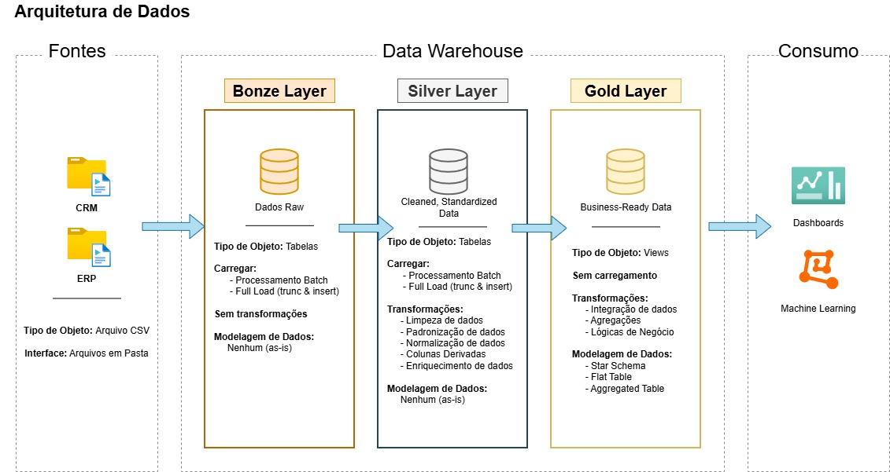
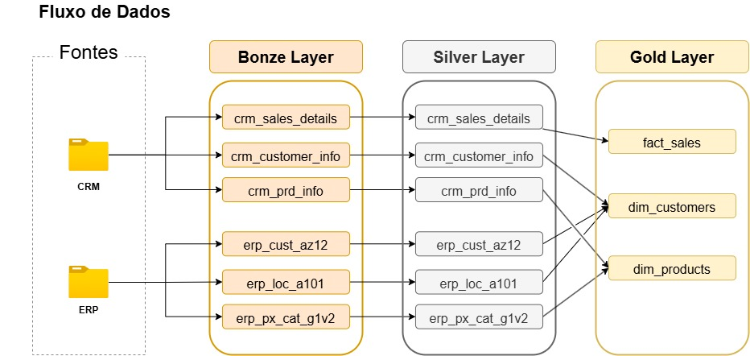
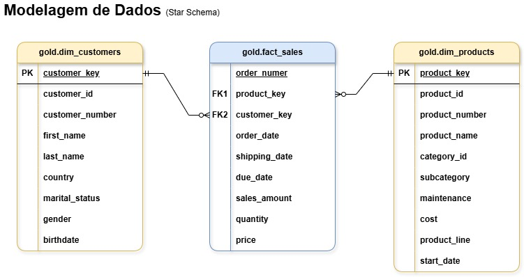

# Projeto Data Warehouse

Este projeto consiste na implementação de um **Data Warehouse** utilizando **Microsoft SQL Server**, seguindo o padrão de **Arquitetura Medalhão** (Bronze, Silver e Gold).

## 🏗️ Arquitetura de Dados

1. **Camada Bronze**: Armazena os dados brutos, provenientes dos sistemas de origem. Os dados são importados de arquivos CSV para um banco de dados SQL Server.
2. **Camada Silver**: Esta camada consiste nos processos de limpeza, padronização e normalização de dados para prepará-los para análise.
3. **Camada Gold**: Armazena dados prontos para uso comercial, modelados em um Star Schema, necessários para geração de relatórios e análises.

## 🔄 Fluxo de Dados

1. Ingestão dos dados das fontes → **Camada Bronze**
2. Tratamento e padronização → **Camada Silver**
3. Modelagem analítica e agregações → **Camada Gold**

## ⭐ Modelagem Dimensional (Star Schema)

O Data Warehouse foi modelado utilizando Star Schema, com uma tabela fato central e tabelas dimensão ao redor.

- **Tabela Fato – gold.fact_sales**

    Armazena os eventos de vendas, sendo definida no grão de uma linha por pedido e produto.

- **Dimensão Clientes – gold.dim_customers**

    Contém informações descritivas dos clientes, permitindo análises por perfil demográfico e geográfico.

- **Dimensão Produtos – gold.dim_products**

    Armazena os dados descritivos dos produtos, possibilitando análises por categoria, linha de produto e ciclo de vida.

## 📖 Visão Geral do Projeto

Este projeto envolve:

1. **Arquitetura de Dados**: Projetar um Data Warehouse moderno usando Arquitetura Medalhão com camadas **Bronze**, **Silver** e **Gold**.
2. **Pipelines ETL**: Extrair, transformar e carregar dados de sistemas de origem para o data warehouse.
3. **Modelagem de Dados**: Desenvolver tabelas de fatos e dimensões otimizadas para consultas analíticas.

## 👩🏻‍💻 Gabriela Trombetta

